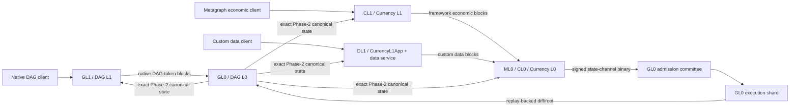
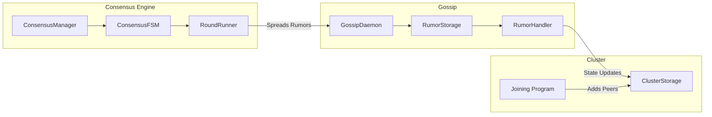
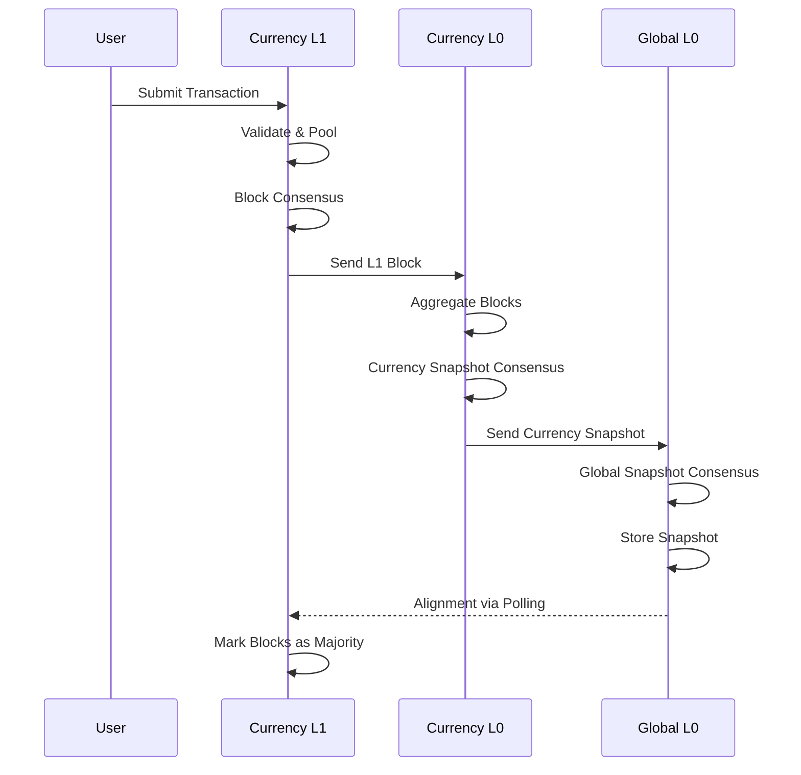
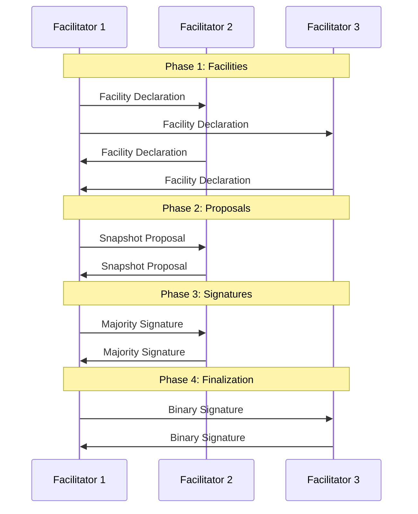

# Codebase Map

> Auto-generated by Cartographer. Last mapped: 2026-01-22. The topology below was
> corrected 2026-07-11; detailed consensus authority is maintained in
> `review/CONSENSUS-ARTIFACT-LIFECYCLE.md`.

## Target Economic Topology

The diagram and authority rules in this section are the target, not a claim about
the current implementation. In particular, current checkpoint payloads contain no
canonical state diff and ordinary GL0 adoption still recreates currency state. See
`review/CONSENSUS-ECONOMIC-SECURITY-ROADMAP.md` section 2 for source reality.

Tessellation is the Constellation Network Node Software - a DAG-based distributed ledger with global and metagraph execution paths. The layer names are not interchangeable: DAG L1 is GL1, while metagraph L1 is the conceptual CL1/DL1 pair that feeds ML0.



ML0 operators, the GL0 binary-admission committee, and the GL0 execution-shard
committee are distinct roles. Every execution signer independently replays before
signing; ordinary noncommittee GL0 nodes apply the canonical diff and recompute
its root. GL0 uses Taktikos/LDD plus optimistic/depth phases; ML0 may remain BFT.

## Directory Structure

```
tessellation/
├── modules/
│   ├── shared/           # Core data structures, crypto, serialization (164k tokens)
│   ├── kernel/           # Recursion schemes (Droste), category theory (4k tokens)
│   ├── keytool/          # Key management, PKCS12 keystores (4k tokens)
│   ├── wallet/           # CLI wallet operations (6k tokens)
│   ├── node-shared/      # P2P networking, consensus, gossip (419k tokens)
│   ├── dag-l0/           # GL0 global consensus, settlement, canonical MPT, finality
│   ├── dag-l1/           # GL1 native DAG-token edge application
│   ├── currency-l0/      # ML0/CL0 metagraph snapshot consensus
│   ├── currency-l1/      # CL1 framework economics or DL1 with an injected data app
│   ├── rosetta/          # Blockchain data standardization API (17k tokens)
│   ├── sdk/              # SDK for metagraph development (0.5k tokens)
│   ├── tools/            # CLI utilities for testing (4k tokens)
│   └── test-shared/      # Test utilities and generators (0.8k tokens)
├── docker/               # Docker configuration (27k tokens)
├── .github/              # CI/CD workflows (77k tokens)
├── doc/                  # API documentation (82k tokens)
└── project/              # SBT build configuration (4k tokens)
```

## Module Guide

### shared (Core)

**Purpose**: Foundation layer with core data structures, cryptography, and serialization.

**Entry points**: All other modules depend on this.

**Key files**:
| File | Purpose |
|------|---------|
| `schema/transaction.scala` | Transaction types with amount, fee, parent reference |
| `schema/Block.scala` | Block structure with DAG parent references |
| `schema/GlobalSnapshot.scala` | Full snapshot with balances, blocks, state channels |
| `schema/GlobalIncrementalSnapshot.scala` | Delta snapshots between ordinals |
| `schema/address.scala` | DAG address format with checksum validation |
| `security/Hash.scala` | SHA-256 hashing with cache |
| `security/signature/Signed.scala` | Multi-signature support with ECDSA |
| `security/mpt/` | Merkle Patricia Trie for state proofs |
| `kryo/KryoSerializer.scala` | Binary serialization |
| `json/JsonSerializer.scala` | JSON serialization with Brotli compression |

**Key patterns**:
- Newtype pattern for zero-cost type wrappers
- Refined types for compile-time validation (`PosLong`, `NonNegLong`)
- `Fiber[Reference, Data]` trait for reference/data separation
- Derevo derivations for automatic typeclass instances

---

### node-shared (P2P & Consensus)

**Purpose**: Core distributed systems infrastructure shared by L0 and L1.

**Entry points**: `app/NodeShared.scala`, `modules/SharedServices.scala`

**Key files**:
| File | Purpose |
|------|---------|
| `infrastructure/consensus/state/ConsensusState.scala` | FSM state for consensus rounds |
| `infrastructure/consensus/engine/ConsensusRoundRunner.scala` | Round execution and stall detection |
| `infrastructure/gossip/GossipDaemon.scala` | Anti-entropy gossip protocol |
| `infrastructure/gossip/RumorHandler.scala` | Kleisli-based rumor processing |
| `infrastructure/cluster/storage/ClusterStorage.scala` | Peer membership tracking |
| `domain/cluster/programs/Joining.scala` | Two-way handshake join protocol |
| `http/p2p/middlewares/PeerAuthMiddleware.scala` | Signature-based authentication |

**Architecture (shared BFT engine, used by ML0; not the GL0 lifecycle)**:



**ML0/shared BFT phases**: CollectingFacilities → CollectingProposals → CollectingSignatures → CollectingBinarySignatures → Finished. These are forbidden as a GL0 target lifecycle.

**Gossip types**:
- Peer rumors: Origin-specific with consecutive ordinals
- Common rumors: Content-addressed by hash

---

### dag-l0 (Global L0 Validator)

**Purpose**: Global consensus layer that aggregates all metagraph state channels.

**Entry point**: `Main.scala` → `TessellationIOApp`

**Key files**:
| File | Purpose |
|------|---------|
| `Main.scala` | Application entry point (Cluster ID: `6d7f1d6a-...`) |
| `infrastructure/snapshot/GlobalSnapshotConsensus.scala` | Factory for consensus engine |
| `infrastructure/snapshot/GlobalSnapshotConsensusFunctions.scala` | Snapshot creation/validation |
| `domain/cell/L0Cell.scala` | Hylomorphism for event processing |
| `infrastructure/rewards/Rewards.scala` | Classic + delegated rewards |
| `modules/Services.scala` | Service wiring |
| `modules/Storages.scala` | Storage wiring |

**Key APIs**:
- `POST /state-channels/{address}/snapshot` - Receive metagraph snapshots
- `POST /dag/l1-output` - Receive L1 blocks
- `GET /global-snapshots/{ordinal}` - Query snapshots

**Target GL0 snapshot flow**:
1. GL1 blocks, admitted metagraph binaries/checkpoints, and protocol events enter bounded queues
2. The Taktikos/LDD `SnapshotLeaderLoop` selects a slot-eligible staircase leader and exact chain parent
3. Producer constructs and fully executes the candidate; receivers authenticate and execute/verify it against that exact parent
4. maxvalid-tk/maxvalid-bg selects the canonical chain; no facilitator proposal/vote/lock/QC/view-change round exists
5. The hash-bound `FinalityGate` advances each exact canonical snapshot through P0/P1/P2; P2 is selected by decided-attestation `T_weight` or canonical `k1` depth
6. P2 makes reversible operational state available downstream while `maxvalid-bg` density fork choice remains active
7. `k2 = 100 * k1` is only a recommended local retention, proof-service, and rollback-capacity horizon; if objective comparison needs older unavailable history, the node enters `RecoveryRequired` until exact authenticated reconstruction permits ordinary fork choice to resume

Current source still contains dormant inherited BFT manager/route plumbing and an
ordinal-only route gate. See the roadmap source-reality table; do not infer target
behavior from generic `ConsensusEventLoop` construction.

---

### dag-l1 (GL1 / Global L1 Validator)

**Purpose**: Native DAG-token block creation and consensus. GL1 submits directly to GL0; it is not DL1 and does not route through ML0.

**Entry point**: `Main.scala` (Cluster ID: `17e78993-...`)

**Key files**:
| File | Purpose |
|------|---------|
| `StateChannel.scala` | Block creation/acceptance runtime |
| `domain/consensus/block/BlockConsensusInput.scala` | Consensus input types |
| `domain/consensus/block/RoundData.scala` | Round state tracking |
| `domain/block/BlockService.scala` | Block validation and acceptance |
| `domain/snapshot/programs/SnapshotProcessor.scala` | L0 snapshot alignment |

**Block creation flow**:
1. Own round trigger fires (every 5s if transactions available)
2. Proposal exchanged with facilitator peers
3. Transactions merged and validated
4. Multi-signed block created
5. Block gossiped and sent to L0
6. Background daemon accepts blocks into local state

**L1-L0 interaction**:
- L1 → L0: `L0BlockOutputClient.sendL1Output()`
- L0 → L1: `GlobalL0Service.pullGlobalSnapshot()` for alignment

---

### currency-l0 / currency-l1

**Purpose**: ML0/CL0 runs metagraph snapshot consensus. Currency L1 runs either CL1 framework economics or, when a custom data-application service is injected, DL1 application logic. ML1 is only an umbrella term for CL1 and DL1.

**Entry points**: `CurrencyL0App.scala`, `CurrencyL1App.scala`

**Key differences from DAG modules**:
| Aspect | DAG-L0/L1 | Currency-L0/L1 |
|--------|-----------|----------------|
| Snapshot type | `GlobalIncrementalSnapshot` | `CurrencyIncrementalSnapshot` |
| State | Global (all metagraphs) | Single metagraph |
| Data application | N/A | Optional custom consensus |
| Extension points | Minimal | Rewards, validators, data apps |

**Extension points for metagraph developers**:
- `dataApplication`: Custom data block processing
- `rewards`: Custom reward distribution
- `transactionValidator`: Custom validation logic
- `customArtifacts`: Additional snapshot artifacts

---

### kernel (Recursion Schemes)

**Purpose**: Category theory abstractions using Droste.

**Key exports**:
- `Cell[M, F, A, B, S]` - Hylomorphism container
- `Ω` - Terminal object
- `StackF` - Computation stack functor
- `PipeArrow` - Arrow instance for FS2 Pipes

---

### keytool & wallet (CLI Tools)

**keytool commands**:
- `generate` - Generate key pair to .p12 keystore
- `migrate` - Migrate legacy keystores
- `export` - Export private key as hex

**wallet commands**:
- `show-address`, `show-id`, `show-public-key`
- `create-transaction` - Sign and create transactions
- `create-delegated-stake`, `withdraw-delegated-stake`
- `create-token-lock`, `create-node-params`

---

### rosetta (API Standardization)

**Purpose**: Coinbase Rosetta API implementation (v1.4.14).

**Key services**:
- `NetworkApiService` - Network status, options, peers
- `ConstructionService` - Transaction construction (derive, combine, parse)

---

### sdk (Metagraph Development)

**Purpose**: Stable API facade for external metagraph developers.

**Usage**: Add as dependency with `provided` scope to access all Tessellation functionality.

**Key exports**:
- `SecurityProvider[F]` - Cryptographic operations
- `keypair.generate[F]` - Key generation

---

## Data Flow

### Transaction Lifecycle



### Consensus Round



## Conventions

### Code Style
- **Functional**: Tagless final with `F[_]` effect types
- **Resource management**: `Resource[F, A]` for lifecycle
- **State**: `Ref`, `MapRef`, `Queue` from Cats Effect
- **Composition**: Kleisli chains for handlers
- **Optics**: Monocle lenses for immutable updates

### Naming
- `*Storage` - Data access layer
- `*Service` - Business logic
- `*Client` - HTTP client
- `*Routes` - HTTP endpoints
- `*Daemon` - Background processes
- `*Program` - High-level orchestration

### Types
- Extensive use of refined types (`PosLong`, `NonNegLong`)
- Newtype wrappers for type safety
- `NonEmpty*` collections for guarantees
- `Sorted*` collections for determinism

## Gotchas

1. **Consensus serialization**: Existing Kryo/JSON paths are migration debt, not an
   extension point. New consensus objects require the canonical Scodec era and
   cross-runtime byte vectors from the active roadmap.
2. **Hash caching**: Uses `System.identityHashCode()` - object identity, not equality
3. **ML0 consensus stalls**: The timeout/lock/ack machinery belongs to the existing
   ML0 BFT engine. It is not the GL0 consensus lifecycle.
4. **L1 alignment**: Polls L0, doesn't push - eventual consistency model
5. **State proofs**: MPT roots computed on snapshot, not per-transaction
6. **Trust storage removed**: The historical TrustStorage / l0Trust / EigenTrust+DATT+Self-Avoiding-Walk stack was never wired into consensus and has been deleted. Peer selection is now uniform-random over ready peers, narrowed by majority-ordinal/majority-hash consensus.
7. **Java 21 required**: Enforced at build time, needed for Kryo reflection

## Navigation Guide

**To add a new transaction type**:
1. Define in `modules/shared/src/main/scala/io/constellationnetwork/schema/`
2. Add one strict canonical Scodec codec and golden/cross-runtime vectors; JSON may
   be added only as a non-consensus API/debug representation
3. Add it to the closed framework input/output ADTs and reference interpreter
4. Update production validation, authorization, conservation, replay protection,
   root/write-set ownership, and the relevant shard/global execution path
5. Add differential and adversarial tests from the active protocol test plan

**To add a new HTTP endpoint**:
1. Define route in `modules/{module}/http/routes/`
2. Wire in `modules/{module}/modules/HttpApi.scala`
3. Add client in `http/p2p/clients/` if P2P

**To modify consensus**:
1. For GL0, start with `SnapshotLeaderLoop`, Taktikos chain selection, and the
   hash-bound `FinalityGate` target. Global BFT votes/locks/QCs/view changes are
   forbidden.
2. For execution shards, start with ADR-0017, checkpoint chain/duty, the shared
   replay kernel, and verified diff adoption. Execution signatures require replay.
3. For ML0 only, the generic consensus FSM/engine/declarations remain the BFT
   implementation surface.
4. Update the lifecycle, owner-decision register, roadmap, and protocol tests in
   the same change; no consensus rule may live only in local configuration.

**To add a new metagraph feature**:
1. Extend `CurrencyL0App` / `CurrencyL1App`
2. Override extension points (dataApplication, rewards, validators)
3. Use SDK as dependency for stable API

**To run tests locally**:
```bash
just test                    # Full: compile + docker + tests
just test --skip-assembly    # Reuse JARs
sbt "dagL0/test"             # Single module
```

## Build & Deploy

### Local Development
```bash
sbt compile                  # Compile all
sbt runLinter                # Format + lint
just test                    # Full E2E test
just up                      # Start environment
just down                    # Stop environment
```

### CI Pipeline
1. `check-scala-code.yml` - Quality gate (lint + tests)
2. `e2e-functionality-tests.yml` - 8 parallel test scenarios
3. `release.yml` - Version, tag, build JARs, publish SDK

### Deployment Targets
- **Test clusters**: `just` recipes bring up Docker-based multi-node clusters (`just test`, `just up`, `just down`). For the full docker-network topology, IP/port bands, layer wiring (gl0/gl1/ml0/cl1/dl1 + sidecars), startup order, and run/debug SOP, see **[docs/nakamoto/E2E-CLUSTER-TOPOLOGY.md](nakamoto/E2E-CLUSTER-TOPOLOGY.md)**.
- **Production**: bare JARs run as standalone Java processes (no container orchestration)
