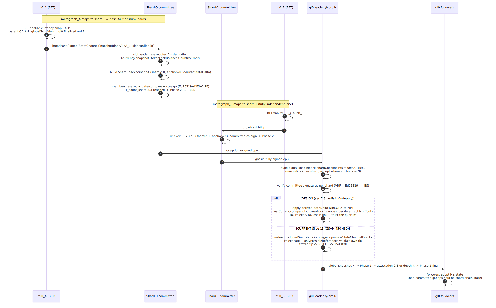
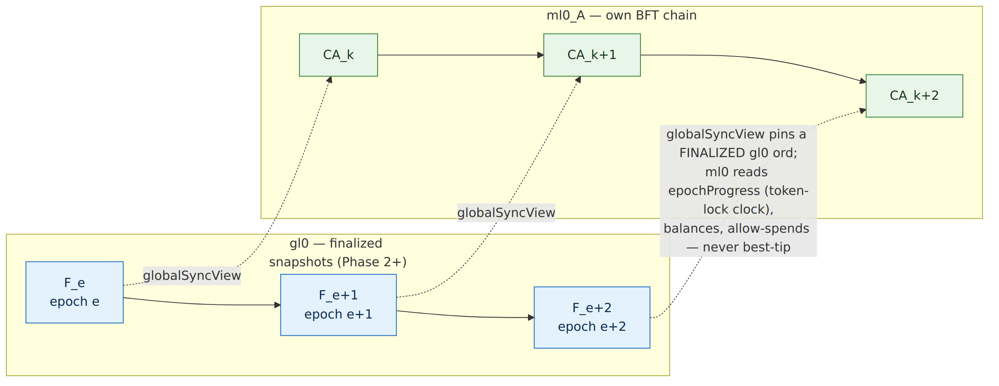
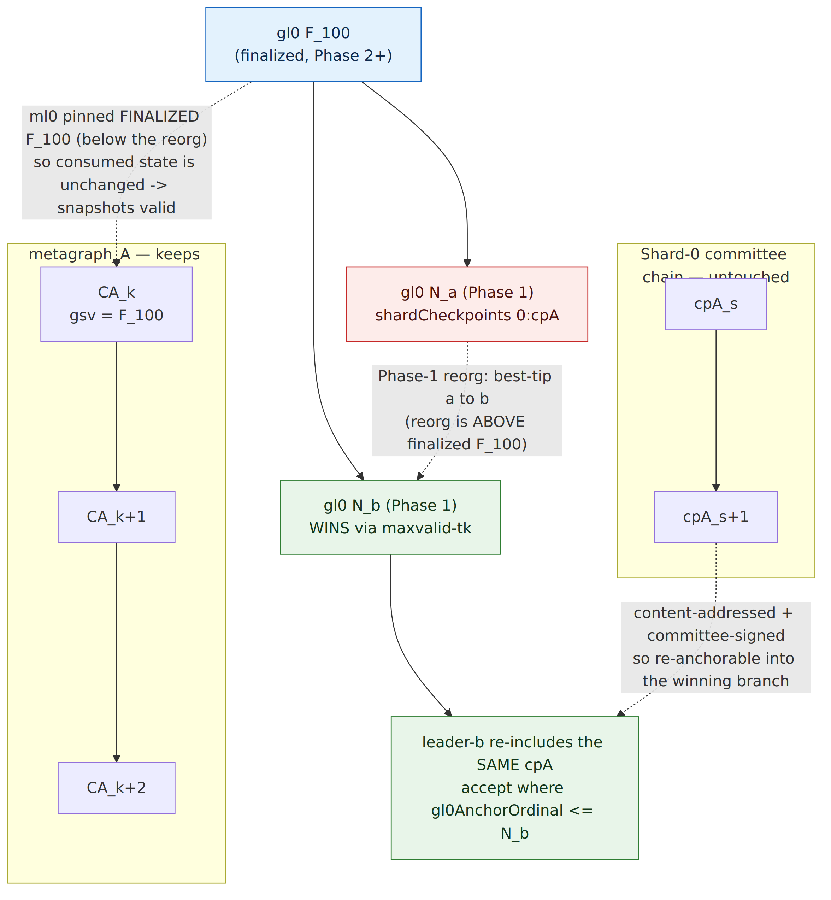

# Shard-checkpoint flow — metagraph → hypergraph walkthrough

Traces, step by step: how two metagraphs on two different shards produce snapshots and get
integrated into the hypergraph (gl0); how the hypergraph advancing feeds back into metagraph
state; and how a hypergraph reorg is (and isn't) absorbed. Grounded in
`HIERARCHICAL-SHARD-CHECKPOINTS-DESIGN.md` (the design) + the current code, and flags where the
**current Slice-13 implementation diverges from the design** (the #259 root + fix target).

Cast:
- **metagraph_A** — currency metagraph, address `A`. `shardIdFor(A) = hash(A) mod 4 = 0`.
- **metagraph_B** — currency metagraph, address `B`. `shardIdFor(B) = 1`.
- **Shard-0 / Shard-1 committees** — *different* VRF-sortitioned subsets of the 8 gl0 operators.
- Each metagraph runs its **own BFT consensus internally** (ml0/cl1/dl1), unchanged (`§2.3`).

Layer terms: a **metagraph snapshot** = `Signed[StateChannelSnapshotBinary]` (wraps a
`CurrencyIncrementalSnapshot` + a tiny `globalSyncView` = `(ordinal, hash, epochProgress)`,
`globalSnapshotSync.scala:38`). A **shard checkpoint** = `Signed[ShardCheckpoint]` (committee-signed;
carries `ShardDerivedStateDelta`). A **global snapshot** = `Signed[GlobalIncrementalSnapshot]`
(carries `SortedMap[ShardId, Signed[ShardCheckpoint]]`).

---

## 0. Current-vs-design gap (why this matters)

The design (`§2.2`, `§7.3`): the shard committee re-executes a metagraph's transitions, signs a
checkpoint, and **gl0 accepts the checkpoint by signature threshold and applies its
`derivedStateDelta` directly** — gl0 does *not* re-run chain-link or re-execute.

The current **Slice-13** wiring (`GlobalSnapshotAcceptanceManager.scala:450-489`, commit
`cfca30cfb`/`1b27e0a7f`) is an explicit *minimal* "regression bar": it verifies the committee
signatures, takes only `derivedStateDelta.includedSnapshots`, **re-feeds them through the legacy
`processStateChannelEvents` pipeline** (re-execute + `onlyPossibleReferences` chain-link against
gl0's own tip), and **discards** the committee's `tokenLockBalancesDelta` / `perMetagraphMptRoots`.
The legacy admission path (`MetagraphCommitteeGate`, `stateChannelSnapshots`) was not removed
(Slice 15 / #280 deferred). So gl0 still re-executes + re-chain-links, and a frozen gl0 tip stalls.
The commit message confirms it: *"reExecuteDerivation is the noReExecDerivation stub … Producer
side (priority 2) deferred."* **Deferred completion, not a bug hit.** The ⚠️ branch in the diagram
below marks the deviation.

---

## 1. Steady state — two metagraphs, two shards, into one gl0 ord

What this buys (design):
- **Per-MG re-execution happens once per shard** (the committee), not on every gl0 op (`§2.2`).
- **gl0 accepts a checkpoint as a unit** by signature — no per-binary admission race, so
  `MetagraphCommitteeGate` / `MetagraphOrphanBuffer` / chain-link admission disappear (`§2.2`).
- metagraph_A and metagraph_B never touch each other's shard: different topics, committees,
  mini-chains. That is the execution segmentation.

---

## 2. How the hypergraph advancing influences metagraph state

The metagraph does **not** mutate gl0 state; it **consumes a thin, finality-gated slice of it**
(G1, task #122; `[[project-two-tier-finality-model]]`).

- ml0 embeds `globalSyncView = (ordinal, hash, epochProgress)` pointing at a **finalized** gl0 ord.
- It reads **epochProgress** (the token-lock `unlockEpoch` clock — *this is the
  token-lock-expiration test's clock*), plus **balances / allow-spends** for cross-layer validation.
- gl0 advances + finalizes → ml0's pinned finalized ord advances → its epoch/balance view
  advances → time-based + cross-layer logic progresses. One-directional, gated on *finalized* state.

⚠️ **Implementation caveat (and the subject of the open design question):** the `globalSyncView`
*field* is tiny, but to *read* balances/allow-spends locally, ml0 today **replays gl0's entire
~800K-entry GSI** via `createContext` (`GlobalSnapshotContextFunctions.scala:60-63` notes the full
sync is "~2 min for 800K entries"). That full replay is what forces ml0 to reproduce
`historicalStakeSnapshots` (gl0 leader-election state it cannot reproduce) → the #259 mismatch. It
reads a handful of fields but replays everything. See the consumption-options discussion (separate
note) — the fix is to fetch only consumed fields with MPT inclusion proofs against gl0's committed
finalized root, not replay the GSI.

---

## 3. Hypergraph reorg — how a metagraph keeps growing

### 3a. Phase-1 reorg (common, safe)

gl0 Phases: 0 PENDING → **1 PROVISIONAL (best-tip, reorg-able)** → **2 SETTLED (attestation-2/3 or
depth-k)** → 3 ARCHIVAL. A Phase-1 reorg switches best-tip between competing branches *above* the
finalized point.

Why the metagraph is unaffected:
1. **ml0_A's chain is its own BFT chain** (`§2.3`) — gl0's fork choice has no vote in it.
2. **ml0_A pinned a *finalized* gl0 ord** (`F_100`); the reorg is above it, so nothing ml0
   consumed changed (this is why consumption is finality-gated — #122).
3. **The Shard-0 committee chain is independent** of gl0's fork (its own mini-Taktikos, `§5`).
4. **`gl0AnchorOrdinal` loose coupling (`§7.2`)**: cpA was produced with `anchor=N`; gl0 accepts it
   at *any* ord `≥ N`, so the winning branch re-includes the **same** committee-signed cpA. The
   binaries ride forward unchanged.

Contrast — the legacy/#259 path tied each binary to a *specific* gl0 predecessor hash; a reorg
orphaned it forever (`§1.1`). The checkpoint design admits a *re-includable checkpoint*, not a
*parent-pinned binary*.

### 3b. Phase-2 reorg (the hard case)

A Phase-2 reorg rolls back already-finalized state — a **safety violation** outside the
honest-majority + Taktikos depth-k bounds (`[[project-taktikos-protocol]]`; depth-k set so this is
~10⁻¹²-rare). Even then: ml0_A's chain and the Shard-0 chain still exist (BFT + re-anchorable
checkpoint). The damage is to *consumption* — if `F_100` itself is reorged away, ml0's
`globalSyncView=F_100` references state that no longer exists, so ml0 must re-sync its globalSyncView
and re-derive any snapshot whose consumed gl0 state changed. That is precisely why Phase-2 finality
is the safety boundary and is set deep.

---

## 4. The fix this implies

On `countQualified` acceptance, `processShardCheckpoints` must **apply `derivedStateDelta` directly
to the MPT** (the `§7.3` `verifyAllAndApply` path) instead of re-feeding `includedSnapshots` through
`processStateChannelEvents`; and the legacy `MetagraphCommitteeGate` / `stateChannelSnapshots`
admission must stop sourcing `lastCurrencySnapshots` when `numShards > 1` (Slice 15 / #280). gl0
trusts the committee quorum — it does not re-execute or re-chain-link. That makes the chain-link
stall structurally impossible.

The **consumption side** (metagraph reading gl0 state) is the orthogonal half: replace ml0's full
GSI replay with selective field reads + MPT inclusion proofs against gl0's committed finalized root
(`259-FOLLOWER-TRUST-REDESIGN.md`; same Option-I pattern the design already uses for cross-shard
reads). Both halves are one principle: **trust the attested commitment + prove the slice you read;
never re-execute another layer's work.**

---

Diagram sources: `diagrams/*.mmd` (Mermaid), rendered via `mmdc` to `diagrams/*.png`.
