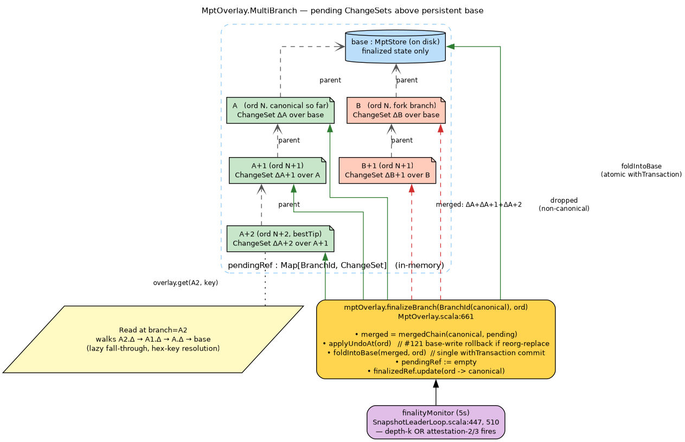

# Attestation flow and finality in Tessellation-Nakamoto GL0

**Status:** living document. Last updated 2026-05-14 with commit `6e49b7d5`
(attestation unification through chain-selection-gated path).

This document describes how Nakamoto GL0 produces and consumes attestations,
how attestations interact with the MPT overlay's pending branches, and how the
two-tier finality monitor (depth-k + attestation-2/3) drives the overlay's
fold-forward sink.

Cross-references:
- [`docs/CODEBASE_MAP.md`](../CODEBASE_MAP.md) — module map.
- [`docs/nakamoto/SYNC-PROTOCOL.md`](./SYNC-PROTOCOL.md) — chain-sync, complementary
  to this document (which focuses on attestation and finalization).
- [`docs/nakamoto-architecture.dot`](../nakamoto-architecture.dot) /
  [`docs/nakamoto-architecture.png`](../nakamoto-architecture.png) — high-level
  consensus architecture diagram.
- `~/.claude/skills/taktikos/SKILL.md` — Taktikos protocol rules
  (LDD snowplow, maxvalid-tk, depth-k sim results). The defaults referenced
  here (`ψ=1`, `γ=15`, `fA=1/2`, `fB=1/20`, `k=255`) come from
  `LddConfig.Default` and `SnapshotLeaderLoop.ConfirmationDepthK`.
- `~/.claude/plans/balmy-branching-bertillon.md` — rev3 MPT overlay plan
  (#56 work track); `FinalizationOutcome` and the multi-branch model are
  defined there.

---

## 1. Top-level model

Each gl0 node maintains three coupled local data structures:

| Structure | Lives in | Purpose |
|---|---|---|
| `NakamotoChainStore` | `dag-l0/.../nakamoto/NakamotoChainStore.scala` | The fork-DAG of known tips; supports `bestTip` (Taktikos maxvalid-tk), `walkBackTo`, `finalize` (advance the local finalized boundary). |
| `MptOverlay` | `node-shared/.../nakamoto/overlay/MptOverlay.scala` | Per-process key/value MPT with multi-branch ChangeSets above an on-disk base; `finalizeBranch` folds the canonical branch into base. |
| `TipTracker` | `node-shared/.../nakamoto/TipTracker.scala` | `Map[PeerId, TipAttestation]` of latest attestation per peer, used by both fork-choice tie-breakers and attestation-2/3 finality. |

These three are bridged by **`SnapshotLeaderLoop.finalityMonitor`** (a 5s `fs2.Stream`
that runs concurrently with the slot tick) and **`NakamotoSyncDaemon`** (which
consumes inbound sidecar gossip and drives `processValidSnapshot` and
`handleAttestation`).

The "sidecar" is the Go libp2p GossipSub process bridged via gRPC at
`SidecarClient` (`node-shared/.../nakamoto/SidecarClient.scala`). Outbound
attestations and snapshots go through this. Inbound is consumed by
`SidecarRumorBridge` (`node-shared/.../nakamoto/SidecarRumorBridge.scala`) for
rumor-typed gossip and by `NakamotoSyncDaemon`'s own subscription streams for
typed `pb.Snapshot` / `pb.TipAttestation` messages.

---

## 2. Self-attestation broadcast (production path)


([`attestation-self-broadcast.dot`](attestation-self-broadcast.dot))

When a node's `slotTick` fires (`SnapshotLeaderLoop.scala:238`, 1s default
cadence; configurable via `NAKAMOTO_SLOT_DURATION_MS`), the node:

1. Reads the **slot gap** from `lastKnownSlotRef` (slots elapsed since last
   stored chain tip) and computes its **own relative stake** via
   `StakeRegistry`.
2. Computes **eta** for the current rotation period from the chain history
   (`EtaCalculation.computeEta`). Period 0 → genesis eta; later periods derive
   deterministically from VRF outputs of the previous period.
3. Calls `EligibilityChecker.checkEligibility(vrfSK, slot, slotGap, eta,
   relativeStake, lddConfig)`. Returns `Some((proof, vrfOutput))` if the node
   beat its LDD threshold for this slot, else `None`.
4. On `Some(...)`: enters `onSlotWon` (`SnapshotLeaderLoop.scala:303`).

`onSlotWon` is bracketed by `mptStore.withTransaction`. Inside:

- `createProposalArtifact` constructs the snapshot and accumulates writes into
  an `MptOverlay.BranchHandle` for the new branch (keyed by the raw artifact
  hash). The writes are not visible to readers outside this branch.
- `chainStore.store(signed, context, ordinal, slot, parentHash, vrfOutput)` is
  the local-only commit to the fork-DAG (`SnapshotLeaderLoop.scala:709`).
- `mptOverlay.rekey(BranchId(rawArtifactHash), BranchId(snapshotHashedForStorage.hash))`
  re-keys the branch so it can be located by the cert-bearing snapshot hash
  later.
- The transaction commits on `MptTxAction.Commit` if `chainStore.store` returned
  true (snapshot accepted as a new tip); rolls back otherwise.

After the transaction:

- `setHeadForRecovery` + `lastGlobalSnapshotStorage.setForRecovery` +
  `lastNGlobalSnapshotStorage.setForRecovery` + `lastKnownSlotRef.set` advance
  the local canonical-state pointers.
- The production gate is rechecked; if still open the node broadcasts via
  `sidecarClient.publishSnapshot` (`SnapshotLeaderLoop.scala:766`).
- **The unified self-attestation entry point** (Phase 2, commit `6e49b7d5`):
  `NakamotoSyncDaemon.emitTipAttestation` (`NakamotoSyncDaemon.scala:1146`) is
  called with the snapshot hash, slot, and ordinal.

### `emitTipAttestation` internals

`NakamotoSyncDaemon.scala:1146-1184`:

1. **Read wall-clock time** via `Clock[F].realTime` (referentially transparent,
   F-typed — *not* `System.currentTimeMillis()`). Convert to seconds; this is
   the `attestedAt` field of the domain `TipAttestation`. Wall-clock seconds is
   the canonical "newer wins" key in `TipTracker.recordAttestation`
   (`TipTracker.scala:96-105`).
2. **Write locally** via `tipTracker.recordAttestation(selfId, localAtt)` —
   `localAtt = TipAttestation(tipHash, tipSlot, tipOrdinal, attestedAt)`.
3. **Sign** the hash of `localAtt` with the node's keypair using the
   project's `HasherSelector.withCurrent` pipeline (JSON-encode → hash → ECDSA
   sign). Same pipeline as `SignatureProof.fromData` / `Signed.forAsyncHasher`.
4. **Broadcast** via `sidecarClient.publishAttestation` — gRPC to the Go sidecar,
   which publishes on the GossipSub attestation topic.

Prior to commit `6e49b7d5`, `SnapshotLeaderLoop.onSlotWon` had its own inline
self-attestation block computing the same four steps with `attestedAt =
slotRefined` (slot number, ~hundreds), while `NakamotoSyncDaemon.emitAttestation`
(triggered when we receive a snapshot via gossip) used `attestedAt =
System.currentTimeMillis() / 1000L` (~1.7B). This asymmetry meant peer
attestations always shadowed self-attestations under `TipTracker`'s "newer
wins" rule. The Phase 2 change unifies both paths through `emitTipAttestation`
and both paths now read time via `Clock[F].realTime` for referential
transparency.

---

## 3. Peer-attestation and peer-snapshot receive


([`attestation-peer-receive.dot`](attestation-peer-receive.dot))

The Go sidecar exposes two subscription streams which `NakamotoSyncDaemon`
consumes:

**Inbound `pb.Snapshot`** — full snapshot from another producer's `publishSnapshot`:
1. Decode + validate VRF + signature + slot-cert + chainStore.store (computes
   `becameBest` from `chainStore.bestTip.hash === thisHash`,
   `NakamotoSyncDaemon.scala:643-664`).
2. Route through `processValidSnapshot` (`NakamotoSyncDaemon.scala:670`,
   implementation at `:833`). This:
   - Updates `networkTipOrdinal` / `networkTipHash` tracking.
   - If `becameBest=true`: pauses the production gate (`ReorgInProgress`),
     calls `setHeadForRecovery` and `last*SnapshotStorage.setForRecovery` on
     the local canonical pointers, resumes the gate.
   - **`tipTracker.recordAttestation(producerId, att)`** at line 900 —
     "the producer is implicitly attesting to their own tip". This credits the
     producer's `peerId` with an attestation entry for the snapshot they
     produced.
   - **`emitAttestation(snap, …)`** at line 916 — fires **unconditionally**,
     even when `becameBest=false`. This calls our own
     `tipTracker.recordAttestation(selfId, …)` with the received snapshot's
     hash, *regardless of whether it's on our canonical chain*.

**Inbound `pb.TipAttestation`** — explicit attestation from another peer's
`publishAttestation` (`NakamotoSyncDaemon.scala:1051-1087`):
1. Decode and recover the attester's `peerId`.
2. Reconstruct domain `TipAttestation`, hash it via the standard pipeline.
3. Look up the attester's public key, verify ECDSA signature against the hash.
4. If valid: `tipTracker.recordAttestation(attesterId, domainAtt)`. If invalid
   or unsigned: drop with a warn log.

### The "selfId.tipHash drift" subtlety

Step 4 of the snapshot path (`emitAttestation` at line 916) is unconditional.
If a peer broadcasts a snap on a fork branch and our local chain has
`bestTip` on a different chain at the same ordinal, our `selfId` TipTracker
entry is moved onto the fork-branch's hash. The canonical-hash filter in
`TipTracker.highestFinalizedOrdinal` (`TipTracker.scala:133-160`) then drops
our own vote to zero weight on our canonical chain. **This is the gap the
Phase 3 re-attestation ticker exists to rescue** — see §5.

---

## 4. MPT overlay branches at the tip


([`overlay-branches.dot`](overlay-branches.dot))

`MptOverlay.MultiBranch` (`MptOverlay.scala`):
- `base: MptStore` — on-disk persistent key-value MPT holding **finalized
  state only**.
- `pendingRef: Map[BranchId, ChangeSet]` — in-memory pending branches keyed
  by `BranchId` (a newtype over the snapshot's hash). Each `ChangeSet`
  contains key-level upserts and removals over its parent branch.
- A branch's effective state is `base ⊕ chain-of-parent-ChangeSets`. Reads
  via `overlay.get(branch, key)` walk the chain lazily and fall through to
  base on miss.

When `GSAM.accept()` builds a snapshot, it `overlay.checkout(parentBranchId)`
to obtain a `BranchHandle`, mutates state through that handle (writes go to a
new ChangeSet keyed by the in-progress snapshot's hash), and the bracket
returns the handle so the caller can call `overlay.commit(handle, childBranchId,
ordinal)` after sealing the snapshot. Multiple snapshots at the same ordinal
(fork branches) each become their own branch in `pendingRef`. **Sibling
isolation**: a write on branch `B` is invisible to a reader at `A` at the same
parent. There is no cross-branch read leakage.

### `finalizeBranch(canonical, ordinal)`

`MptOverlay.scala:661`. Two outcomes encoded in `FinalizationOutcome`:
- `Folded(keysApplied, branchesDropped)` — canonical branch found in pending,
  its full chain of ChangeSets is merged and folded into base atomically
  (single `MptStore.withTransaction` bracket, see partition-atomicity
  contract `#56.4.5`). All sibling pending branches are dropped.
- `NoOp` — already finalized at the same (ordinal, hash); idempotent.

Reorg-replace path (`MptOverlay.scala:685-749`): when a different hash was
previously finalized at the same ordinal, the **undo journal** (#121) is
replayed to revert the prior canonical's writes from base before folding the
new canonical. This plugs the "base may still hold rejected writes" leak
seen in the iter19 forensics.

---

## 5. The 5-second finality monitor


([`finality-monitor.dot`](finality-monitor.dot))

`SnapshotLeaderLoop.scala:381-552`. On every 5s tick:

### 5.1 Phase 3 re-attestation ticker (added by commit `6e49b7d5`)

`SnapshotLeaderLoop.scala:396-412`. Reads `allAtts <-
tipTracker.allAttestations` and `bestTip <- chainStore.bestTip`. If

```
bestTip = Some(tip) AND !allAtts(selfId).tipHash === tip.hash
```

(either we never attested anything, OR our last self-attestation points at a
hash that isn't current bestTip), call `NakamotoSyncDaemon.emitTipAttestation(
tipHash=tip.hash, tipSlotLong=tip.slot, tipOrdinal=tip.ordinal, …)` and log
at INFO level (`RE-ATTEST bestTip change …`).

Why: rescue our own vote from the "selfId.tipHash drift" described in §3.
Without it, peer-snapshot arrivals leave us silently disenfranchised on our
own canonical chain.

### 5.2 Depth-k finality (Bitcoin-style)

`SnapshotLeaderLoop.scala:425-481`. If

```
tip.ordinal - lastFinalizedOrdinal > ConfirmationDepthK
```

(default `k = 255`, env override `NAKAMOTO_CONFIRMATION_DEPTH`), the snapshot
at `tip.ordinal - k` is structurally finalized:

1. `walkBackTo(tip.hash, finalizeAtOrdinal)` returns the canonical hash at that
   ordinal on our local best chain.
2. `chainStore.get(canonicalHash)` returns the stored snapshot so we can read
   its slot value (slots are LDD-paced, NOT 1:1 with ordinals — never compute
   `tip.slot - k` instead of using the canonical snapshot's actual slot).
3. Apply the four-write sink: `tipTracker.markFinalized` → `pruneBelow` →
   `chainStore.finalize` → `mptOverlay.finalizeBranch`.

### 5.3 Attestation-2/3 finality (GRANDPA-style)

`SnapshotLeaderLoop.scala:489-543`. Calls
`tipTracker.highestFinalizedOrdinal(threshold=2/3, canonicalHashAt =
walkBackTo(tip.hash, _))`:

`TipTracker.highestFinalizedOrdinal` (`TipTracker.scala:133-160`):
- Walks all attestations in `attestationsRef` sorted by `tipOrdinal` descending.
- For each `(peerId, att)`: looks up `canonicalHashAt(att.tipOrdinal)` — the
  hash on **our** local canonical chain at that ordinal. If it matches
  `att.tipHash`, accumulate `stakeRegistry.optimisticRelativeStake(peerId)`
  into the running weight; else contribute zero. (This is the canonical-hash
  filter; it prevents cross-fork attestation contamination.)
- Returns the highest ordinal where cumulative weight ≥ `threshold`.

If the returned ordinal beats `lastFinalizedOrdinal` AND depth-k didn't fire
in the same tick:
- Walk back from bestTip to find the canonical hash at the attestation-
  finalized ordinal.
- Apply the same four-write sink as depth-k: `markFinalized` → `pruneBelow` →
  `chainStore.finalize` → `mptOverlay.finalizeBranch`.

If `walkBackTo` returns `None` — we're on a fork that doesn't contain the
attested ordinal — enqueue a `chainSyncRequestQueue.request(finalOrdinal)` so
we proactively pull the better chain.

---

## 6. Why we still rely on the canonical-hash filter

In a GRANDPA-style design, each peer's attestation is "I saw this snapshot
and it's valid." Different peers may attest to different forks at the same
ordinal. The canonical-hash filter in `highestFinalizedOrdinal` ensures that
weight from a peer who attested to fork B doesn't count toward finalizing
fork A on **our** chain — even if both are well-formed.

This is the **hash-aware** generalisation of GRANDPA. The hash-agnostic
predecessor silently let forked chains each "finalize" their local fork
(observed in a 3-node cluster where gl0-2 forked: all three nodes logged
ATTEST-FINALIZED at the same ordinals with weight=0.67, yet their mptRoots
were permanently different — see iter14 forensics memory entries and #115).

The filter is load-bearing for safety. The Phase 3 re-attestation ticker
(§5.1) is needed precisely *because* the filter is strict: when our own
selfId attestation drifts onto a non-canonical hash via §3's unconditional
`emitAttestation`, the filter rules us out of our own canonical chain's
weight sum.

---

## 7. Caveats and known issues

- The Phase 3 ticker was added in commit `6e49b7d5` but its log level was
  `debug` and `SnapshotLeaderLoop`'s logger config does not surface DEBUG —
  the first e2e measurements gave zero observability into firing rate.
  Subsequent change raised it to `info` to give real evidence.
- `NakamotoChainStore.store` has a **finality-safety gate**
  (`NakamotoChainStore.scala:290-303`) that refuses to write a different hash
  at an already-finalized ordinal. Combined with `chainStore.finalize` driven
  by 2/3 weight that *includes* our self-attestation, a small-cluster node
  can self-finalize a divergent fork and then refuse the canonical chain's
  hash — the "fork-recovery deadlock" of #117 Path B / #119. The full fix is
  a node-level "I'm permanently divergent → re-bootstrap" path; not in scope
  for the attestation-unification change.
- The undo journal (#121) plugs base-write contamination on reorg-replace,
  but only operates when `finalizeBranch` is called with a different hash at
  an already-finalized ordinal. It does NOT cover the case where a snapshot's
  ChangeSet is dropped from `pendingRef` without ever being folded (which is
  the normal "this fork branch lost chainSelection" outcome — those writes
  never reach base, by design).

---

## 8. File map

| File | Role |
|---|---|
| `modules/dag-l0/.../nakamoto/SnapshotLeaderLoop.scala` | Slot tick, eligibility, onSlotWon production path, finalityMonitor (5s tick — depth-k + attestation-2/3 + Phase 3 re-attestation ticker). |
| `modules/dag-l0/.../nakamoto/NakamotoSyncDaemon.scala` | Inbound gossip handlers: `processValidSnapshot`, `handleAttestation`. The unified `emitAttestation` + `emitTipAttestation` outbound entry. |
| `modules/dag-l0/.../nakamoto/NakamotoChainStore.scala` | Fork-DAG of tips. `bestTip`, `store`, `finalize`, `walkBackTo`. Finality-safety gate at `:290-303`. |
| `modules/node-shared/.../nakamoto/TipTracker.scala` | `Map[PeerId, TipAttestation]`. Newer-wins via `attestedAt`. `highestFinalizedOrdinal` chain-aware weight walk. |
| `modules/node-shared/.../nakamoto/overlay/MptOverlay.scala` | Branch-aware MPT: `pendingRef`, `BranchHandle`, `checkout/commit`, `finalizeBranch` (#56). |
| `modules/node-shared/.../nakamoto/ChainSelection.scala` | Taktikos maxvalid-tk / maxvalid-bg fork choice. Purely structural. |
| `modules/node-shared/.../nakamoto/EligibilityChecker.scala` | LDD threshold function (ψ, γ, fA, fB). |
| `modules/node-shared/.../nakamoto/StakeRegistry.scala` | Per-peer stake fractions; `optimisticRelativeStake` for active-only weighting. |
| `modules/node-shared/.../nakamoto/SidecarClient.scala` | gRPC client to Go libp2p sidecar (`publishSnapshot`, `publishAttestation`, `publishRumor`). |
| `modules/node-shared/.../nakamoto/SidecarRumorBridge.scala` | Subscribe→Rumor inbound bridge for non-typed gossip. |

## 9. Rendering the diagrams

The `.dot` sources live next to this file. To render:

```bash
dot -Tpng attestation-self-broadcast.dot -o attestation-self-broadcast.png
dot -Tpng attestation-peer-receive.dot   -o attestation-peer-receive.png
dot -Tpng overlay-branches.dot           -o overlay-branches.png
dot -Tpng finality-monitor.dot           -o finality-monitor.png
```

(Requires graphviz: `sudo apt-get install graphviz` on Debian/Ubuntu.)
