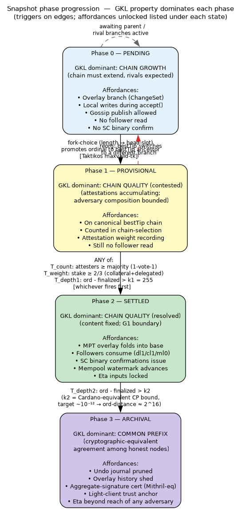
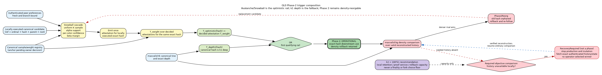
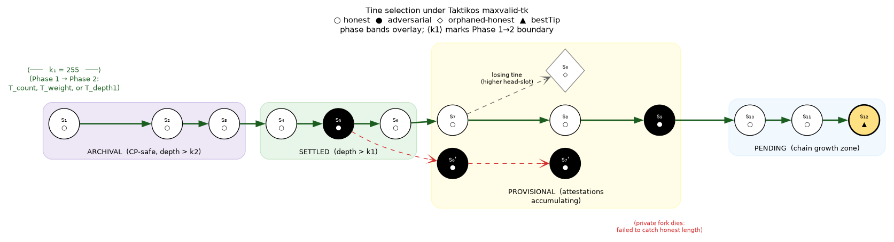
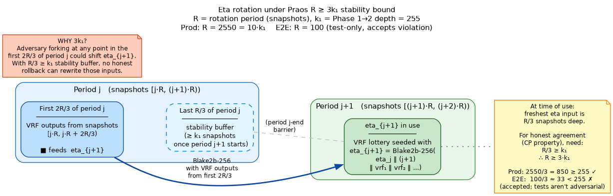
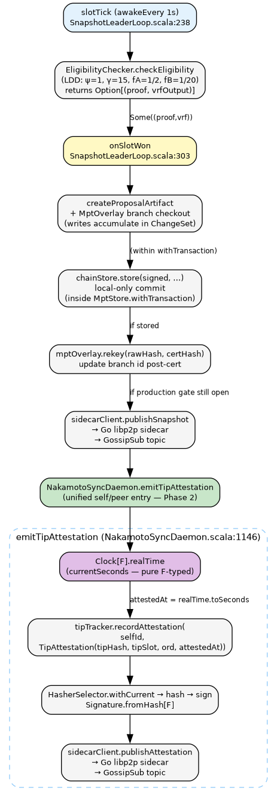
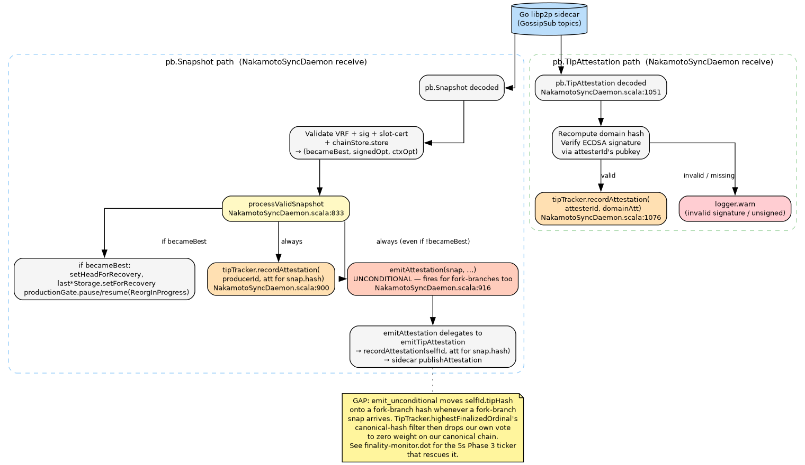
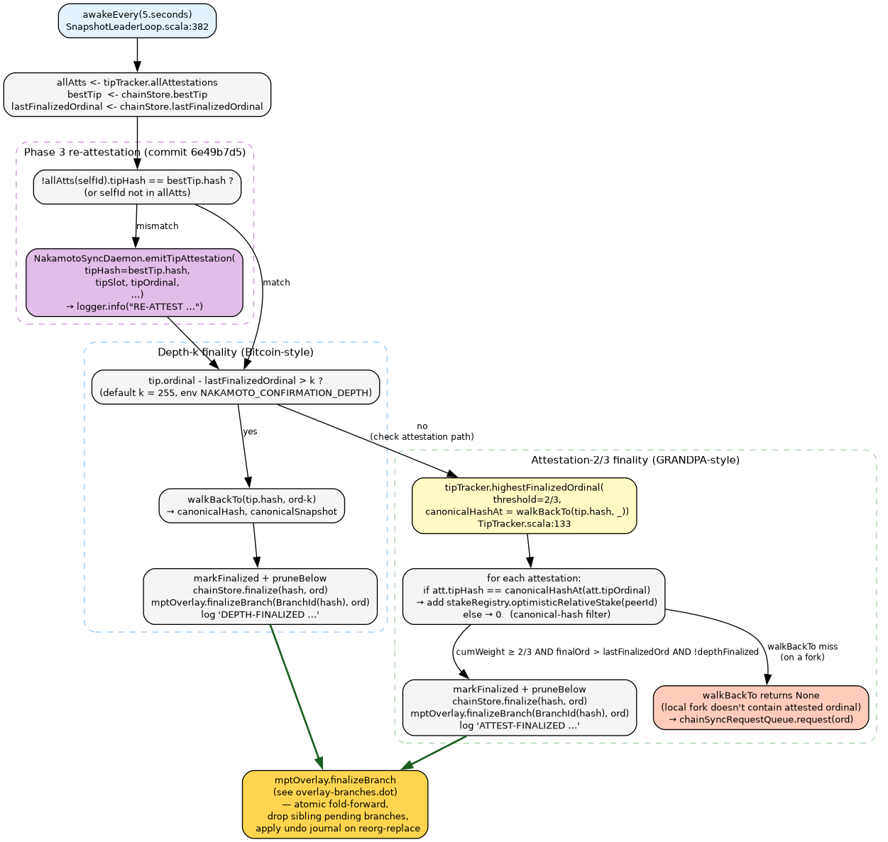

# Attestation flow and finality in Tessellation-Nakamoto GL0

**Status:** living document. Last updated 2026-05-14 — 4-phase formalization,
GKL property mapping, eta-rotation R ≥ 3k₁ bound (unit migrated to snapshots),
chain-selection scope per phase. Supersedes the prior single-tier finality
framing.

This document formalizes the chain-growth model for Tessellation-Nakamoto and
describes how the operational components (attestation, chain selection,
finality, eta rotation, MPT overlay) compose under it.

Cross-references:
- [`docs/CODEBASE_MAP.md`](../CODEBASE_MAP.md) — module map.
- [`docs/nakamoto/SYNC-PROTOCOL.md`](./SYNC-PROTOCOL.md) — chain-sync, complementary
  to this document (which focuses on attestation and finalization).
- [`docs/nakamoto-architecture.dot`](../nakamoto-architecture.dot) /
  [`docs/nakamoto-architecture.png`](../nakamoto-architecture.png) — high-level
  consensus architecture diagram.
- `~/.claude/skills/taktikos/SKILL.md` — Taktikos protocol rules
  (LDD snowplow, maxvalid-tk, depth-k sim results). Defaults referenced here
  (`ψ=1`, `γ=15`, `fA=1/2`, `fB=1/20`, `k₁=255`) come from `LddConfig.Default`
  and `SnapshotLeaderLoop.ConfirmationDepthK`.
- `~/.claude/plans/balmy-branching-bertillon.md` — rev3 MPT overlay plan
  (#56 work track); `FinalizationOutcome` and the multi-branch model are
  defined there.

---

## 0. The four-phase chain-growth model

Tessellation-Nakamoto formalizes chain growth as a four-phase progression
parameterized by **independent, sufficient triggers**. Each snapshot ordinal
advances monotonically through the phases; phases gate distinct system
affordances (overlay branching, follower reads, MPT base writes, archival
pruning).

The model is the **Garay-Kiayias-Leonardos (GKL)** properties — Chain Growth
(CG), Chain Quality (CQ), Common Prefix (CP) — projected onto a snapshot's
lifetime. Carries forward through Ouroboros Praos (David et al. 2018) and
Taktikos (FC 2023).

### 0.1 Phases


([`phase-state-machine.dot`](phase-state-machine.dot))

| Phase | Name | GKL property dominant | Key affordances |
|---|---|---|---|
| **0** | **PENDING** | **Chain Growth** | overlay ChangeSet active; rivals at same ordinal expected; gossip publish allowed; **no** follower read |
| **1** | **PROVISIONAL** | **Chain Quality (contested)** | on canonical bestTip ancestor; attestation weight accumulating; still **no** follower read |
| **2** | **SETTLED** | **Chain Quality (resolved)** | MPT overlay folds into base; G1 boundary — followers consume; SC binary confirms; eta inputs locked |
| **3** | **ARCHIVAL** | **Common Prefix** | depth-k₂ deep; undo journal pruned; aggregate-signature cert producible; light-client trust anchor |

The intuition:
- **Chain Growth is strongest at the tip** — Phase 0 is where blocks are
  added; the property "the chain keeps extending" applies here.
- **Common Prefix is strongest at archival depth** — Phase 3 is where the
  chain is cryptographically locked; the property "honest nodes agree past
  depth k" is operative.
- **Chain Quality is the tension** — too-low k₁ or sticky fork-choice lets
  adversary blocks crowd in; too-high k₁ orphans honest blocks. Phase 1↔2
  is where the trigger thresholds (T_count, T_weight, T_depth1) calibrate
  this tradeoff.

### 0.2 Triggers (Phase 1 → 2)


([`trigger-composition.dot`](trigger-composition.dot))

The Phase 1→2 transition is gated by multiple independent triggers, of
which any single one is sufficient:

| Trigger | Test | Source |
|---|---|---|
| `T_count` | `|attesters with canonical-hash match| ≥ ⌈|active|/2⌉ + 1` | future — 1-validator-1-vote; Sybil-resistant for equal-stake |
| `T_weight` | `Σ stakeᵢ across canonical-hash attesters ≥ 2/3 active stake` | `TipTracker.FinalityThreshold` (`NAKAMOTO_ATTESTATION_THRESHOLD`) |
| `T_depth1` | `tip.ordinal - lastFinalizedOrdinal > k₁` (default 255) | `SnapshotLeaderLoop.ConfirmationDepthK` (`NAKAMOTO_CONFIRMATION_DEPTH`) |

Today only `T_weight` and `T_depth1` are wired. The proposed refactor
(`FinalityTrigger[F]` typeclass) makes `T_count` a drop-in addition and
opens the path for future triggers (NIPoPoW superblock anchors, etc.).

The semantics are **max-of**: the Phase 2 boundary at any tick is the
maximum `latestQualifying` ordinal across all registered Phase-2 triggers.
Each trigger gives a *sufficient* condition, not a *necessary* one.

### 0.3 Trigger (Phase 2 → 3)

| Trigger | Test | Rationale |
|---|---|---|
| `T_depth2` | `tip.ordinal - lastFinalizedOrdinal > k₂` | Cardano-equivalent CP-violation < 10⁻¹². Target `k₂ = 2¹⁶ = 65536` snapshots. |

`T_depth2` is the cryptographic-equivalent "never rollback" bound. Once
reached, downstream subsystems (overlay history pruning, aggregate
certificate emission, light-client anchor publication) become safe.

### 0.4 Component scope per phase

The cleanest operational consequence of the phase model is that each
subsystem has a well-defined active phase range:

| Component | Active in phases | Notes |
|---|---|---|
| `ChainSelection.standardCompare` (Taktikos maxvalid-tk) | 0, 1 | short-fork rule (< k₁ back) |
| `ChainSelection` density rule (Ouroboros Genesis maxvalid-bg) | 0, 1 | deep-fork rule (≥ k₁ back); operationally rare in steady state |
| Attestation triggers `T_count`, `T_weight` | 1 | accumulate weight on canonical-hash matches |
| Depth trigger `T_depth1` | 1 → advances to 2 | structural fallback when attestation gates stall |
| MPT overlay `pendingRef` writes | 0, 1 | per-branch ChangeSets above persistent base |
| MPT overlay `finalizeBranch` (fold into base) | at Phase 2 boundary | fires on Phase 1 → 2 transition |
| G1 follower consumption (dl1/cl1/ml0 pull) | from Phase 2 | `pullFinalityGated` |
| Eta-rotation use of period j VRF outputs | from Phase 2 | the first 2/3 of period j must reach Phase 2 before period j+1 begins |
| Depth trigger `T_depth2` | 2 → advances to 3 | archival depth gate |
| Undo journal pruning, overlay history shedding | from Phase 3 | reorg-recovery structures no longer required |
| Aggregate-signature certificate (Mithril-equivalent) | from Phase 3 | light-client trust anchor |

**The density rule (Genesis maxvalid-bg) is operationally bounded to
Phase 0/1.** Once a snapshot reaches Phase 2, no chain-selection rule can
touch it; once it reaches Phase 3, even cryptographic adversary advantage
is negligible.

> **Note on Cardano:** Cardano runs Praos as its steady-state consensus.
> The Ouroboros Genesis density rule is included in `cardano-node` for
> bootstrap correctness and deep-fork-recovery (e.g. a node joining from
> scratch faced with multiple divergent histories), but rarely fires in
> normal mainnet operation. Our `ChainSelection` mirrors this: maxvalid-tk
> for short forks (the common case), maxvalid-bg density for deep forks
> (the recovery case).

### 0.5 Tine selection illustration


([`tine-selection.dot`](tine-selection.dot))

Praos-style tine diagram with phase bands overlaid. Honest snapshots ○,
adversarial ●, orphaned-honest ◇. The brace ⟨k₁⟩ marks the Phase 1→2
boundary; the trunk to the left of it is the agreed common prefix.

---

## 1. Eta rotation under the R ≥ 3k₁ bound


([`eta-rotation-timeline.dot`](eta-rotation-timeline.dot))

Eta is the long-lived VRF nonce that seeds slot-leader eligibility. To
prevent grinding attacks, eta_{j+1} must be:
1. Derived from VRF outputs of period **j** (not j+1), and
2. The VRF inputs used must be **CP-safe at the time of use** — i.e. all
   honest nodes agree on them.

### 1.1 The 2/3 cut

`EtaCalculation.scala:30-35` (`twoThirdsCutoff`): eta_{j+1} is computed
from VRF outputs in the **first 2R/3** of period j, where R is the
rotation-period length. `NakamotoChainStore.collectVrfOutputsForPeriod`
(`NakamotoChainStore.scala:365-386`) walks the canonical chain only — so
all honest nodes seeing the same canonical chain compute the same eta.

### 1.2 The R ≥ 3k₁ bound

By the time period j+1 starts (i.e. eta_{j+1} begins seeding the lottery):
- VRF inputs were emitted in slots `[j·R, j·R + 2R/3)` of period j.
- They are now at least `R/3` snapshots deep on the canonical chain.

For these inputs to be CP-safe (operationally, at Phase 2 — Settled), we
require:

```
R / 3 ≥ k₁     ⇒     R ≥ 3·k₁
```

with some `epsilon` for safety margin.

This is the standard Praos eta-stability bound (Praos 2018 §5.4 "epoch
nonce stability"; GKL 2015 §6).

### 1.3 Per-environment R configuration

R is measured in **snapshots**, not slots — the security argument is
about CP-safety of inputs (a snapshot-indexed property), and slot rate
varies under LDD-fill drift.

Defaults (Cardano uses `R = 10·k`; we follow the same ratio in
production):

| Environment | k₁ | R (snapshots) | Multiplier | Notes |
|---|---|---|---|---|
| **production** | 255 | 2550 | 10·k₁ | matches Cardano R/k ratio; ~4.7 hr at 15% LDD-fill at 1s/slot |
| **e2e tests** | 255 | 100 | 0.39·k₁ | violates R ≥ 3k₁ but tests aren't adversarial; chosen to exercise rotation mechanism many times per run |
| **expanded sims** | 255 | 765 | 3·k₁ | minimum-compliant; for sim runs that want to model rotation behavior under attack |

**Status:** unit migration from slots to snapshots landed. The env var
is `NAKAMOTO_ETA_ROTATION_SNAPSHOTS` (production default 2550, e2e
default 100). `EtaCalculation.rotationPeriod` keys on **ordinal**, and
`NakamotoChainStore.collectVrfOutputsForPeriod` walks back filtering by
ordinal range — slots are not consulted for rotation decisions. The old
`NAKAMOTO_ETA_ROTATION_SLOTS` env var is removed (pre-prod, no
backwards-compat shim).

### 1.4 Period-assignment determinism — predecessor-keyed

Period assignment is keyed on the **predecessor ordinal**: when a snapshot
is produced at ordinal *N*, both producer and verifier compute
`currentPeriod = (N - 1) / R`. This makes the period a function of the
snapshot itself (the predecessor is universally known via `snap.lastSnapshotHash`),
not of the observer's local `bestTipOrdinal`.

Why this matters: an earlier draft of the migration keyed period on
`chainStore.bestTipOrdinal` directly. At the producer that was already
the predecessor (`bestTipOrdinal == N - 1` at production time), but the
verifier site used `snap.ordinal` raw. The off-by-one at every R-boundary
caused producer/verifier disagreement on which eta to expect, stalling
finality at the boundary (iter35 stalled at ord=99 with R=100). Aligning
both sites on `(N - 1) / R` restores universal agreement.

The 2/3-cut input-stability argument (§1.2) is independent: it ensures
the VRF *inputs* feeding a derived eta are CP-safe by the time they're
used. Period *assignment* and input *stability* are two distinct
properties — predecessor-keying fixes the first; R ≥ 3·k₁ ensures the
second.

---

## 2. Top-level state model

Each gl0 node maintains three coupled local data structures:

| Structure | Lives in | Purpose |
|---|---|---|
| `NakamotoChainStore` | `dag-l0/.../nakamoto/NakamotoChainStore.scala` | Fork-DAG of known tips; `bestTip` (Taktikos maxvalid-tk), `walkBackTo`, `finalize` (advance the local finalized boundary at the Phase 1→2 transition). |
| `MptOverlay` | `node-shared/.../nakamoto/overlay/MptOverlay.scala` | Per-process key/value MPT with multi-branch ChangeSets above an on-disk base; `finalizeBranch` folds the canonical branch into base at the Phase 1→2 transition. |
| `TipTracker` | `node-shared/.../nakamoto/TipTracker.scala` | `Map[PeerId, TipAttestation]`; supplies inputs to `T_count` and `T_weight`. |

These are bridged by **`SnapshotLeaderLoop.finalityMonitor`** (5s
`fs2.Stream` running concurrently with the slot tick) and
**`NakamotoSyncDaemon`** (inbound sidecar gossip → `processValidSnapshot`,
`handleAttestation`).

The "sidecar" is the Go libp2p GossipSub process bridged via gRPC at
`SidecarClient` (`node-shared/.../nakamoto/SidecarClient.scala`).
Outbound attestations and snapshots go through this. Inbound is consumed
by `SidecarRumorBridge` for rumor-typed gossip and by `NakamotoSyncDaemon`'s
own subscription streams for typed `pb.Snapshot` / `pb.TipAttestation`.

---

## 3. Self-attestation broadcast (production path)


([`attestation-self-broadcast.dot`](attestation-self-broadcast.dot))

When a node's `slotTick` fires (`SnapshotLeaderLoop.scala:238`,
configurable via `NAKAMOTO_SLOT_DURATION_MS`):

1. Reads the **slot gap** from `lastKnownSlotRef`; computes own relative
   stake via `StakeRegistry`.
2. Computes **eta** for the current rotation period from chain history
   (`EtaCalculation.computeEta`). Period 0/1 → genesis eta; later periods
   derive from the first 2/3 of the previous period's canonical VRF
   outputs (see §1).
3. Calls `EligibilityChecker.checkEligibility(vrfSK, slot, slotGap, eta,
   relativeStake, lddConfig)`. Returns `Some((proof, vrfOutput))` if the
   node beat its LDD threshold for this slot.
4. On `Some(...)`: enters `onSlotWon`.

`onSlotWon` is bracketed by `mptStore.withTransaction`:
- `createProposalArtifact` accumulates writes through an
  `MptOverlay.BranchHandle` keyed by the raw artifact hash. Writes are
  not visible to readers outside the branch (Phase 0 isolation).
- `chainStore.store(signed, …)` commits to the fork-DAG locally.
- `mptOverlay.rekey(rawHash, withCertHash)` re-keys the branch by the
  cert-bearing snapshot hash so ord N+1's parent walk finds it.
- `MptTxAction.Commit` if `chainStore.store == true`; `Rollback` else.

After the transaction (still in Phase 0 for this snapshot):
- Canonical-state pointers advance for recovery.
- Snapshot is published via `sidecarClient.publishSnapshot`.
- Self-attestation is emitted via `NakamotoSyncDaemon.emitTipAttestation`
  with `attestedAt = Clock[F].realTime.toMillis` (see §3.1).

### 3.1 `attestedAt` semantics — wall-clock epoch ms (Chronos-prep)

`attestedAt` is **wall-clock epoch milliseconds**, sourced via the typed
`Clock[F].realTime` from cats-effect (NEVER `System.currentTimeMillis()`).
It is a `Long` field on `TipAttestation`, not a `Slot`.

Wall-clock semantics here are deliberate. The `attestedAt` field is
positioned to double as a future **Ouroboros Chronos**-style timestamp
gossip surface: each attestation carries the producer's wall-clock claim
for when it was made, and the protocol can distill a cluster-consensus
time from those claims without needing NTP. Today the field is only used
by `TipTracker.recordAttestation` for the "newer-wins" rule (compares
Longs), but the wire-format and semantics are stable for that future use.

All three emit-paths source `attestedAt` from `Clock[F].realTime`:
- Production self-emit in `onSlotWon` after `chainStore.store` succeeds.
- becameBestTip self-emit in `processValidSnapshot` (peer-snapshot path).
- §5.1 visibility-ticker re-emit.

The peer-receive handler (`handleAttestation`) takes `att.attestedAt`
directly off the wire (the peer's wall-clock claim).

Earlier iterations used `System.currentTimeMillis()` (non-typed) and
later attempted `attestedAt: Slot` keyed to a `SlotClock` (dimensionally
clean but blocked the Chronos use-case). The current `Long` epoch-ms
shape is stable.

---

## 4. Peer-attestation and peer-snapshot receive


([`attestation-peer-receive.dot`](attestation-peer-receive.dot))

The Go sidecar exposes two subscription streams consumed by
`NakamotoSyncDaemon`:

**Inbound `pb.Snapshot`** — full snapshot from another producer's
`publishSnapshot`:
1. Decode + validate VRF + signature + slot-cert + chainStore.store
   (computes `becameBest` from `chainStore.bestTip.hash === thisHash`).
2. Route through `processValidSnapshot`. This:
   - Updates `networkTipOrdinal` / `networkTipHash` tracking.
   - If `becameBest`: pauses production gate (`ReorgInProgress`), calls
     `setHeadForRecovery`, resumes the gate.
   - `tipTracker.recordAttestation(producerId, att)` — credits the
     producer's `peerId` with an attestation entry (implicit attestation
     by producing).
   - `emitAttestation(snap, …)` — **see §4.1 below for the gating
     correction**.

**Inbound `pb.TipAttestation`** — explicit attestation from another
peer's `publishAttestation`:
1. Decode and recover the attester's `peerId`.
2. Reconstruct domain `TipAttestation`, hash via the standard pipeline.
3. Look up attester pubkey, verify ECDSA signature against the hash.
4. If valid: `tipTracker.recordAttestation(attesterId, domainAtt)`.
   Invalid/unsigned: drop with a warn log.

### 4.1 The `emitAttestation`-on-peer-receive gating correction

> **Status:** in-progress design correction. Commit `6e49b7d5` introduced
> *unconditional* `emitAttestation` on peer-receive. iter33 + iter34
> e2e failures traced to this regression: any peer's fork-branch snap
> can move our self-attestation off canonical, after which the
> canonical-hash filter (see §6) zeros our weight contribution. The
> Phase 3 re-attestation ticker (§5.1) was added to rescue this but
> doesn't address the root cause.

The correct gating: `emitAttestation` in `processValidSnapshot` should
only fire when `becameBest = true` — i.e. chain-selection promoted the
peer's snapshot to **our** canonical bestTip (a Phase 0 → 1 transition).
Without this gating, our self-attestation can drift onto Phase 0
fork-branches that lost chain selection, breaking Phase 1 → 2 weight
accumulation.

The Phase 3 ticker should be retained as a *safety net* for the case
where chain-selection flips bestTip during a 5s window (so our self-att
is on a previous bestTip), but should not be the primary attestation
correctness mechanism.

---

## 5. The 5-second finality monitor


([`finality-monitor.dot`](finality-monitor.dot))

`SnapshotLeaderLoop.scala:381-552`. On every 5s tick:

### 5.1 Phase-1 visibility check (re-attestation ticker)

`SnapshotLeaderLoop.scala:396-412`. If `allAtts(selfId).tipHash !== bestTip.hash`
(our last self-attestation doesn't match current canonical), emit a
fresh self-attestation pointing at bestTip. Log at INFO:
`RE-ATTEST bestTip change …`.

**Operationally**: a Phase 0 → Phase 1 visibility patch. Rescues our
contribution to T_weight / T_count when chain-selection has moved our
canonical view but we haven't re-attested.

This is a *safety net*, not the primary self-attestation mechanism (see
§4.1).

### 5.2 T_depth1: depth-k₁ finality (Phase 1 → Phase 2 trigger)

`SnapshotLeaderLoop.scala:425-481`. If
`tip.ordinal - lastFinalizedOrdinal > k₁` (default 255), the snapshot at
`tip.ordinal - k₁` is structurally finalized:

1. `walkBackTo(tip.hash, finalizeAtOrdinal)` returns the canonical hash.
2. `chainStore.get(canonicalHash)` returns the stored snapshot (read its
   slot — slots are LDD-paced, NOT 1:1 with ordinals).
3. Apply the four-write sink: `tipTracker.markFinalized` →
   `pruneBelow` → `chainStore.finalize` → `mptOverlay.finalizeBranch`.

This is the Bitcoin-style probabilistic CP fallback.

### 5.3 T_weight: attestation-2/3 finality (Phase 1 → Phase 2 trigger)

`SnapshotLeaderLoop.scala:489-543`. Calls
`tipTracker.highestFinalizedOrdinal(threshold=2/3, canonicalHashAt = walkBackTo(tip.hash, _))`:

`TipTracker.highestFinalizedOrdinal` (`TipTracker.scala:133-160`):
- Walks all attestations sorted by `tipOrdinal` descending.
- For each `(peerId, att)`: looks up `canonicalHashAt(att.tipOrdinal)` —
  the hash on **our** canonical chain at that ordinal. If it matches
  `att.tipHash`, accumulate `stakeRegistry.optimisticRelativeStake(peerId)`;
  else contribute zero. (Canonical-hash filter — prevents cross-fork
  contamination.)
- Returns highest ordinal where cumulative weight ≥ 2/3.

If returned ordinal beats `lastFinalizedOrdinal` AND T_depth1 didn't
fire in the same tick:
- Walk back from bestTip to canonical hash at the finalized ordinal.
- Apply the same four-write sink.

If `walkBackTo` returns `None` (we're on a fork not containing the
attested ordinal) — enqueue `chainSyncRequestQueue.request(finalOrdinal)`
to proactively pull the better chain.

### 5.4 (Future) T_depth2: archival finality (Phase 2 → Phase 3 trigger)

Not yet wired. Once Phase 3 sinks (overlay history pruning, aggregate
certificate emission) are spec'd, this becomes a third gate on the same
tick.

---

## 6. Why the canonical-hash filter is load-bearing

In a GRANDPA-style design, peer attestations are "I saw this snapshot
and it's valid." Different peers may attest to different forks at the
same ordinal. The canonical-hash filter in `highestFinalizedOrdinal`
ensures weight from a peer who attested to fork B doesn't count toward
finalizing fork A on **our** chain.

This is the **hash-aware** generalization of GRANDPA. A hash-agnostic
predecessor silently let forked chains each "finalize" their local fork
(observed in a 3-node cluster where gl0-2 forked; all three logged
ATTEST-FINALIZED at the same ordinals with weight=0.67, yet mptRoots
were permanently different — see iter14 forensics, #115).

The filter is load-bearing for safety. The §5.1 visibility ticker exists
*because* the filter is strict: when self-attestation drifts onto a
non-canonical hash, the filter rules us out of our own canonical chain's
weight sum.

---

## 7. Caveats and known issues

- **`emitAttestation`-on-peer-receive** is currently unconditional
  (commit `6e49b7d5`). Causing iter33/iter34 regressions. See §4.1 for
  the planned gating correction.
- **`NakamotoChainStore.store` finality-safety gate** refuses to write a
  different hash at an already-finalized ordinal
  (`NakamotoChainStore.scala:290-303`). Combined with `chainStore.finalize`
  driven by 2/3 weight including our self-attestation, a small-cluster
  node can self-finalize a divergent fork and then refuse the canonical
  chain's hash — the "fork-recovery deadlock" of #119. Full fix is a
  node-level re-bootstrap path.
- **Undo journal (#121)** plugs base-write contamination on reorg-replace
  but only operates when `finalizeBranch` is called with a different
  hash at an already-finalized ordinal. Does NOT cover the case where a
  ChangeSet is dropped from `pendingRef` without ever being folded — by
  design, those writes never reach base.
- ~~**Eta-rotation R is currently in slots, not snapshots**~~ — **resolved**.
  `NAKAMOTO_ETA_ROTATION_SNAPSHOTS` keys rotation on ordinal; production
  default 2550 = 10·k₁ per Cardano practice. See §1.3.

---

## 8. File map

| File | Role |
|---|---|
| `modules/dag-l0/.../nakamoto/SnapshotLeaderLoop.scala` | Slot tick, eligibility, onSlotWon production path, finalityMonitor (5s tick — T_depth1 + T_weight + §5.1 visibility ticker). |
| `modules/dag-l0/.../nakamoto/NakamotoSyncDaemon.scala` | Inbound gossip: `processValidSnapshot`, `handleAttestation`. Outbound: unified `emitAttestation` / `emitTipAttestation`. |
| `modules/dag-l0/.../nakamoto/NakamotoChainStore.scala` | Fork-DAG of tips. `bestTip`, `store`, `finalize`, `walkBackTo`. Finality-safety gate at `:290-303`. `vrfOutputsForPeriod` for §1's eta rotation inputs. |
| `modules/node-shared/.../nakamoto/TipTracker.scala` | `Map[PeerId, TipAttestation]`. Newer-wins via `attestedAt`. `highestFinalizedOrdinal` chain-aware weight walk. Source for T_weight (today) and T_count (future). |
| `modules/node-shared/.../nakamoto/overlay/MptOverlay.scala` | Branch-aware MPT: `pendingRef`, `BranchHandle`, `checkout/commit`, `finalizeBranch` (#56). Phase 0/1 writes live here; Phase 2 transition triggers `finalizeBranch`. |
| `modules/node-shared/.../nakamoto/ChainSelection.scala` | Taktikos maxvalid-tk (short forks, Phase 0/1) + Ouroboros Genesis maxvalid-bg density rule (deep forks, Phase 0/1). Inactive from Phase 2. |
| `modules/node-shared/.../nakamoto/EligibilityChecker.scala` | LDD threshold function (ψ, γ, fA, fB). |
| `modules/node-shared/.../nakamoto/StakeRegistry.scala` | Per-peer stake fractions (delegated + collateral combined planned); `optimisticRelativeStake` for active-only weighting. |
| `modules/node-shared/.../nakamoto/SlotClock.scala` | Cluster-wide consensus slot provider. Not currently used by the attestation path (Chronos-prep wall-clock semantics; see §3.1); retained as a domain primitive for future consensus-slot consumers. |
| `modules/node-shared/.../nakamoto/EtaCalculation.scala` | Eta computation; `twoThirdsCutoff` for the §1 R ≥ 3k₁ rule. |
| `modules/node-shared/.../nakamoto/SidecarClient.scala` | gRPC client to Go libp2p sidecar (`publishSnapshot`, `publishAttestation`, `publishRumor`). |
| `modules/node-shared/.../nakamoto/SidecarRumorBridge.scala` | Subscribe→Rumor inbound bridge for non-typed gossip. |

---

## 9. Rendering the diagrams

The `.dot` sources live next to this file. To render all eight:

```bash
cd docs/nakamoto/
for d in *.dot; do dot -Tpng "$d" -o "${d%.dot}.png"; done
```

Requires graphviz (`sudo apt-get install graphviz` on Debian/Ubuntu).

| `.dot` file | What it illustrates |
|---|---|
| `phase-state-machine.dot` | The 4-phase progression with trigger labels and affordance lists. |
| `tine-selection.dot` | Praos-style fork diagram (honest ○, adversarial ●, orphaned ◇, bestTip ▲) with phase bands overlay. |
| `eta-rotation-timeline.dot` | Period j → eta_{j+1} flow showing the 2/3 cut and R ≥ 3k₁ stability buffer. |
| `trigger-composition.dot` | T_count + T_weight + T_depth1 → Phase 2; T_depth2 → Phase 3. Max-of semantics. |
| `attestation-self-broadcast.dot` | Production-path attestation flow (onSlotWon → emitTipAttestation → sidecar). |
| `attestation-peer-receive.dot` | Peer-receive paths for `pb.Snapshot` and `pb.TipAttestation`. |
| `finality-monitor.dot` | 5s tick combining §5.1 / §5.2 / §5.3. |
| `overlay-branches.dot` | MPT overlay pendingRef branches and fold-forward to base. |

---

## 10. References

- Garay, Kiayias, Leonardos. *The Bitcoin Backbone Protocol: Analysis
  and Applications*. EUROCRYPT 2015. [GKL] — defines CG / CQ / CP.
- David, Gaži, Kiayias, Russell. *Ouroboros Praos: An Adaptively-Secure,
  Semi-Synchronous Proof-of-Stake Protocol*. EUROCRYPT 2018. — VRF
  lottery + epoch nonce stability.
- Badertscher, Gaži, Kiayias, Russell, Zikas. *Ouroboros Genesis:
  Composable Proof-of-Stake Blockchains with Dynamic Availability*. CCS
  2018. — density-based fork choice for bootstrap.
- Kiayias, Leonardos, Stouka, Zacharias. *Ouroboros Taktikos*. FC 2023.
  — LDD-snowplow, maxvalid-tk.
- Chase, Karayannidis. *Mithril: Stake-based Threshold Multisignatures*.
  IOG technical report 2021. — aggregate signatures over Praos snapshots.
